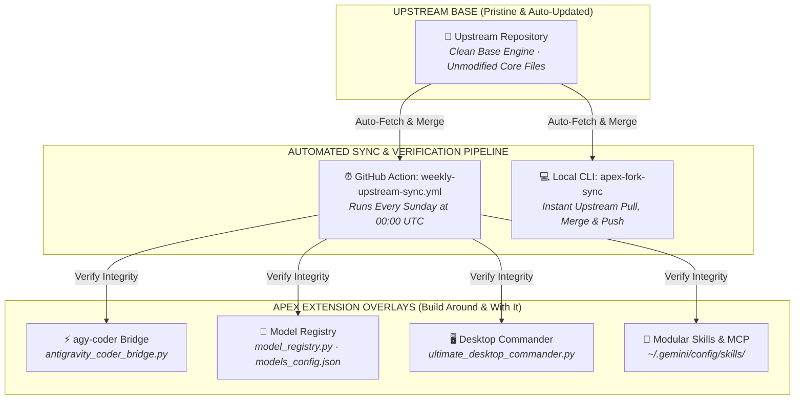

# 🪐 Antigravity CLI — Sovereign Agentic Coding Engine

[](https://github.com/GlacierEQ/antigravity-cli/actions/workflows/weekly-upstream-sync.yml)
[](https://github.com/GlacierEQ/antigravity-cli)
[](https://github.com/GlacierEQ/antigravity-cli)

> **Antigravity CLI brings high-velocity, multi-agent reasoning, deep codebase perception, multi-file synthesis, and autonomous execution directly to your terminal.**

---

## 🔱 The Modular Upstream-Tracking Overlay Architecture

Maintained under the **APEX Dev Fork Doctrine**, this repository tracks upstream continuously while isolating custom tools, subagents, and bridges into modular, collision-free extension layers:



---

## ⚡ Unified Execution Bridge: `agy-coder`

Antigravity CLI orchestrates local coding engines (OpenCode Zen, Kilo Code) and remote free-tier gateways (OpenRouter, Novita AI) through a single unified dispatcher:

```bash
# Auto-route across all available backends (OpenRouter -> OpenCode -> Kilo -> Novita)
agy-coder "Refactor the authentication middleware to use Bearer tokens"

# Dispatch to local OpenCode Zen coding agent
agy-coder --engine opencode --agent coding "Implement zero-byte evidence detector"

# Dispatch to local Kilo Code architectural agent
agy-coder --engine kilo --agent creative "Draft court affidavit executive summary"

# Dispatch to OpenRouter 1.05M multimodal model
agy-coder --engine openrouter --model xiaomi/mimo-v2.5-pro "Analyze audio/video evidence timelines"
```

---

## 🔄 Dynamic In-Session Model Switching

Switch active reasoning engines instantly in any conversation or terminal window:

| Command Syntax | Target AI Model | Context Window | Specialization |
|---|---|:---:|---|
| `/model mimo` or `switch mimo` | **Xiaomi MiMo v2.5 Pro** | **1,050,000** | SOTA Multimodal Audio, Video, Photo, Spatial Forensics |
| `/model r1` or `switch r1` | **DeepSeek R1** | **163,840** | Deep mathematical chain-of-thought, structural proofs |
| `/model deepseek` or `switch deepseek` | **DeepSeek V3 671B** | **65,536** | High-throughput MoE coding and AST refactoring |
| `/model qwen` or `switch qwen` | **Qwen 2.5 Coder 32B** | **32,768** | Specialized syntax repair, unit test generation |
| `/model gemini-free` | **Gemini 2.0 Flash Exp** | **1,048,576** | Massive context ingestion, ultra-low latency |
| `/model kilo` or `switch kilo/coding` | **Kilo Code Architect** | **32,768** | Local token-cost optimization & AST decomposition |
| `/model opencode` or `switch opencode` | **OpenCode Zen Engine** | **64,000** | Local sandbox execution & headless test repair |
| `/model default` | **Antigravity Brain** | **2,000,000** | Full core agentic orchestration & toolbelt |

---

## 🛠️ Specialized Subagent Mesh

Antigravity natively coordinates 4 concurrent background subagents:

1. **`opencode_zen_mega`**: Local sandbox execution, refactoring, and headless test fixes.
2. **`kilo_architect_mega`**: Architectural design, structural decomposition, and token cost optimization.
3. **`mimo_multimodal_mega`**: 1.05M context audio, video, OCR, and document exhibit perception.
4. **`deepseek_r1_mega`**: Chain-of-thought mathematical reasoning, formal logic, and invariant proofs.

---

## 🚀 Installation & Getting Started

### macOS / Linux
```bash
curl -fsSL https://antigravity.google/cli/install.sh | bash
```

### Start Antigravity CLI
```bash
agy
```

---

## 📜 Dev Fork Governance & Upstream Sync

* **Local One-Command Sync**:
  ```bash
  apex-fork-sync
  ```
* **Automated Weekly Sync**: Scheduled every Sunday at 00:00 UTC via [`.github/workflows/weekly-upstream-sync.yml`](.github/workflows/weekly-upstream-sync.yml).
* **Epistemic Standard**: Governed by the **Mastermind Standard** in [`AGENTS.md`](AGENTS.md).
